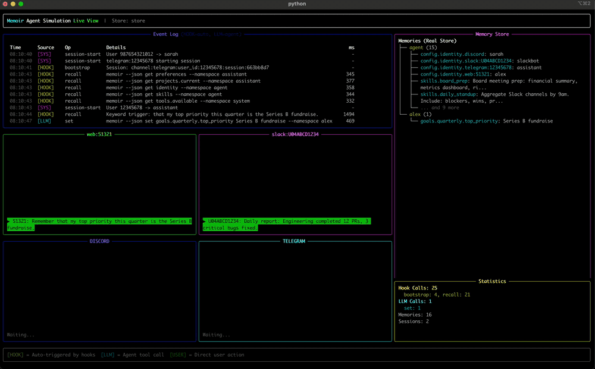

# Memoir

<div align="center">
  <picture>
    <source media="(prefers-color-scheme: dark)" srcset="https://www.memoir-ai.dev/images/memoir.png">
    <source media="(prefers-color-scheme: light)" srcset="https://www.memoir-ai.dev/images/memoir-light.png">
    
  </picture>

  **Git for AI Memory**

  *Hierarchical Memory with Git-Like Version Control*
</div>

[](https://python.org)
[](https://github.com/zhangfengcdt/memoir/blob/main/LICENSE)
[]()
[](https://www.memoir-ai.dev/)
[](https://zhangfengcdt.github.io/memoir/)

<p align="center">
  
</p>

Memoir is a high-performance semantic memory system for AI agents that brings Git-like version control to AI memory management. It replaces opaque vector databases with transparent, versioned, cryptographically secure memory storage using hierarchical semantic paths.

> **Project page:** **[memoir-ai.dev](https://www.memoir-ai.dev/)** — full overview, demos, and roadmap.

## Why agents need versioned memory

> **AI memory is a Global Variable anti-pattern.** Every production agent hits the same three walls: context contamination, token rent, and memory drift. Memoir brings version control to your agent's mind.

**Your agent doesn't respect your git state.**
Context contamination happens every time you `git checkout`. Without branch-aware memory, your agent tries to apply experimental refactor patterns to stable production hotfixes.

**You're paying "token rent" on a flat file.**
Using `CLAUDE.md` or `MEMORY.md` as a global store is a cache-killer. Every minor memory update invalidates your entire prefix cache, forcing you to pay full price to re-process your entire conversation.

**Your agent's memory is code without version control.**
Today's AI memory — `CLAUDE.md`, vector stores, scratchpads — is treated like an append-only blob. One bad session poisons every future retrieval. Without `memoir blame` or `memoir checkout`, there's no way to audit who taught the agent a rule or revert a hallucination without wiping the whole store.

## Key Features

- **Git-like Versioning** — Branch, commit, merge, and rollback memories with cryptographic integrity.
- **Semantic Paths** — Replace UUID keys with meaningful paths like `profile.professional.skills.python`.
- **O(log n) Lookups** — Fast hierarchical search instead of expensive vector operations.
- **Memory Aggregation** — Automatic consolidation of related memories at semantic locations.
- **Clean Architecture** — Proper separation of storage, classification, and search layers.
- **Multiple Search Engines** — Choose between fast keyword-based or intelligent LLM-powered search.

## Multi-agent sessions

<p align="center">
  
  <br>
  <em>Multiple agent sessions working with Memoir.</em>
</p>

## Install from PyPI

```bash
pip install memoir-ai
```

> The distribution name on PyPI is `memoir-ai`. The Python import is `import memoir` and the CLI is `memoir`.

## Install for Claude Code

Inside a Claude Code session, run:

```
/plugin marketplace add zhangfengcdt/memoir
/plugin install memoir@memoir
```

**No manual `pip install` needed if you have `uv` on PATH** — the plugin auto-resolves to `uvx --from memoir-ai memoir` when the bare `memoir` binary isn't installed. Don't have `uv`? Install it once with the standard one-liner:

```bash
curl -LsSf https://astral.sh/uv/install.sh | sh
```

That's enough — the plugin handles the rest. It registers hooks for session start, user-prompt-submit, and stop, so your project gets automatic context injection and auto-captured memories. See the [Claude Code plugin guide](https://zhangfengcdt.github.io/memoir/claude_code/) for the full slash-command and hook reference.

## Install for Codex

Memoir's Codex plugin is distributed from this repository's Codex marketplace. In Codex, run `/plugins`, add the `memoir` marketplace from `zhangfengcdt/memoir`, restart Codex if prompted, then choose **Memoir Plugins** and install `memoir`.

You can also register the marketplace from the CLI:

```bash
codex plugin marketplace add zhangfengcdt/memoir
```

While developing from a local checkout, use `codex plugin marketplace add /absolute/path/to/memoir` instead. The repo marketplace lives at `.agents/plugins/marketplace.json` and points Codex at `./plugins/codex`, relative to the repository root.

**No manual `pip install` needed if you have `uv` on PATH** — the Codex plugin resolves the Memoir CLI the same way the Claude Code plugin does: `memoir` on `PATH` first, then `uvx --from memoir-ai==<pinned> memoir`, then `uv tool run --from memoir-ai==<pinned> memoir`.

Enable Codex hooks with `[features].hooks = true` in `~/.codex/config.toml` or pass `--enable hooks` for a smoke run. The Codex plugin ships lifecycle hooks; `memory-recall`, `memoir-onboard`, `memoir-remember`, `memoir-status`, and `memoir-ui` skills; Codex-specific transcript parsing; and local marketplace metadata. See the [Codex plugin guide](https://zhangfengcdt.github.io/memoir/codex/) for setup, limitations, and the real Codex smoke-test flow.

## Install for Hermes

Memoir is a memory provider for [Hermes](https://github.com/NousResearch/hermes-agent), the Nous Research personal-assistant agent. Install the plugin into your Hermes home and activate it:

```bash
hermes plugins install zhangfengcdt/memoir/plugins/hermes   # or: cp -r plugins/hermes ~/.hermes/plugins/memoir
hermes memory setup                                         # choose "memoir"
```

Hermes then auto-captures durable facts (people, schedule, preferences, standing instructions) each turn and exposes `memoir_recall` / `memoir_remember` / `memoir_forget` / `memoir_status` tools. Capture/classification run on your host-selected model via direct provider APIs (never the `claude` CLI). See the [Hermes plugin guide](https://zhangfengcdt.github.io/memoir/hermes/) for install, configuration, model selection, and proxy routing.

## Community plugins

- **[opencode-memoir](https://github.com/disafronov/opencode-memoir)** brings Memoir's long-term memory workflows to OpenCode through its native plugin system.

## Quick look

Memoir's CLI defaults to Anthropic **`claude-haiku-4-5`** as of v0.1.6 — set your key first:

```bash
export ANTHROPIC_API_KEY="sk-..."
```

Note that if you do not set any model api keys, it will try to use the claude -p command to authenticate via claude code's subscription.

Then create a store and round-trip a memory:

```bash
# 1. Create a memoir store
memoir new my-memoir-store
cd my-memoir-store

# 2. Store with an explicit path (offline, no LLM call)
memoir remember "Sarah prefers tabs and 2-space indents" -p preferences.coding.style

# 3. Store with auto-classification (LLM picks the path; needs API key)
memoir remember "I work in Pacific time"

# 4. Read back by path (offline)
memoir get preferences.coding.style

# 5. Semantic search (LLM-backed)
memoir recall "what does Sarah prefer?"

# 6. Watch a file by indexing it on the fly
memoir watch add ~/papers/transformer.pdf -n research

# 7. Search the indexed content
memoir search "transformer attention mechanism"

# 8. Open the visual explorer (auto-opens in your browser)
memoir ui
```

> Curious what the UI looks like before installing? Browse the [UI Gallery](https://www.memoir-ai.dev/demos/).

Prefer a different model? `memoir recall "..." --model gpt-4o-mini` (needs `OPENAI_API_KEY`), or set `MEMOIR_LLM_MODEL` in your shell. Resolution order: `--model` flag → `MEMOIR_LLM_MODEL` → `claude-haiku-4-5`.

See the full [Quickstart](https://zhangfengcdt.github.io/memoir/quickstart/) for the Python API and version-control workflow.

## Documentation

Full docs live at **[zhangfengcdt.github.io/memoir](https://zhangfengcdt.github.io/memoir/)**:

- [Quickstart](https://zhangfengcdt.github.io/memoir/quickstart/) — five-minute tour of the core loop.
- [CLI Reference](https://zhangfengcdt.github.io/memoir/cli/) — every command, flag, and exit code.
- [UI](https://zhangfengcdt.github.io/memoir/ui/) — the visual explorer (Tree / Graph / Timeline / Places + `/stats`).
- [Claude Code](https://zhangfengcdt.github.io/memoir/claude_code/) — plugin install, slash commands, hooks, lifecycle.
- [Codex](https://zhangfengcdt.github.io/memoir/codex/) — plugin install, hooks, skills, transcript parsing, smoke-test evidence.
- [Architecture](https://zhangfengcdt.github.io/memoir/architecture/) — taxonomy, classifier, store, search.
- [API Reference](https://zhangfengcdt.github.io/memoir/api/memoir/) — Python SDK.
- [Examples](https://zhangfengcdt.github.io/memoir/examples/) — context branching, memory debugging, reproducible testing.

## Contributing

Memoir is alpha and contributions are very welcome — especially from people building coding agents, since that's the audience we're optimizing for. Good first paths in:

- Pick an issue from the [issue tracker](https://github.com/zhangfengcdt/memoir/issues) or open one describing a gap.
- Fork the repo, branch off `main`, and run `make ci` before opening a PR (lint, tests, docs build must be green).
- Bug reports with a minimal reproducer and benchmark / taxonomy proposals for coding-agent use cases are particularly appreciated.

## License

Apache License 2.0 — see [LICENSE](https://github.com/zhangfengcdt/memoir/blob/main/LICENSE).
