# Claude Code Plugin

Memoir ships a first-class plugin for [Claude Code](https://docs.claude.com/en/docs/claude-code/overview). Drop it in and memoir becomes native to your coding sessions: context injected on session start, durable facts auto-captured at turn end, and a full suite of slash commands for everything in between.

The plugin lives in the repo at `plugins/claude-code/`.

## Install

Inside a Claude Code session, run:

```
/plugin marketplace add zhangfengcdt/memoir
/plugin install memoir@memoir
```

The first command registers the memoir GitHub repo as a plugin marketplace; the second installs the `memoir` plugin from that marketplace. Hooks take effect on the next session start.

Each project gets its own memoir store under `~/.memoir/memoir_<hash>/`, derived from your cwd. Override by exporting `MEMOIR_STORE=/path/to/store`.

## What ships

| Component | Count | Role |
|---|---|---|
| Slash commands | 9 | Manual memory ops, admin, UI launch |
| Skills | 2 | Auto-invoked: recall + codebase onboarding |
| Lifecycle hooks | 4 | Context injection + auto-capture |
| Helper scripts | 3 | Store path, UI control, status line |

## Slash commands

| Command | Purpose |
|---|---|
| `/memoir-remember <fact>` | Capture a memory. `-p <path>` skips classification. |
| `/memory-recall <query>` | Recall from prior sessions (delegates to the `memory-recall` skill). |
| `/memoir-forget <key>` | Delete a memory. Always `--force` for non-interactive use. |
| `/memoir-status` | Branch, commit count, memory count, namespaces. |
| `/memoir-taxonomy` | Loaded categories + per-namespace distribution. |
| `/memoir-ui` | Launch or re-open the web UI (readonly, LLM off by default). |
| `/memoir-onboard [--force]` | Populate or refresh the `codebase:onboard` snapshot. |
| `/memoir-unmerged` | List memoir branches ahead of `main`. |
| `/memoir-sync-branch <name>` | Merge a branch into `main` without switching. |

## Skills

| Skill | Namespace | Role |
|---|---|---|
| `memory-recall` | `default` | User-captured facts. Picks taxonomy paths with `summarize`, batches `get`, never invokes nested LLMs. Runs in a forked context. Configured **default on** with aggressive triggering so remembered preferences are never silently skipped. |
| `memoir-onboard` | `codebase:onboard` | Maintains a high-level repo snapshot that seeds future sessions via SessionStart injection. |

The split is deliberate: **recall owns user-captured facts; onboard owns codebase structure.**

### Read/write asymmetry

By design:

- **Reads are auto-triggered via skills.** The agent pulls context when it thinks it might need to, without the user asking.
- **Writes and deletes are explicit slash commands.** `/memoir-remember` and `/memoir-forget` stay as commands — not skills — because the `Stop` hook already handles auto-capture, and deletion is kept explicit for safety.

## Lifecycle hooks

Configured in `plugins/claude-code/hooks/hooks.json`:

| Event | Script | Timeout | Async | Purpose |
|---|---|---|---|---|
| `SessionStart` | `session-start.sh` | 15s | — | Inject store status, branch/commit state, onboard snapshot, and "memory available" hints. |
| `UserPromptSubmit` | `user-prompt-submit.sh` | 10s | — | Surface matching memory hints for the current prompt. |
| `Stop` | `stop.sh` | 180s | yes | Parse the transcript and auto-capture durable facts into the taxonomy. |
| `SessionEnd` | `session-end.sh` | 5s | yes | Cleanup. |

Shared helpers: `hooks/common.sh`, `hooks/parse-transcript.sh`.

## Helper scripts

| Script | Role |
|---|---|
| `derive-store-path.sh` | Maps the current cwd to `~/.memoir/memoir_<hash>`. Respects `$MEMOIR_STORE`. |
| `memoir-ui-ctl.sh` | `start` / `stop` / `status` for the web UI, with pidfile bookkeeping so repeated `/memoir-ui` calls reuse the same server. |
| `statusline.sh` | Renders memoir state into Claude Code's status line, e.g. `memoir: feature/foo · 14 memories`. |

## Lifecycle

A session flows through four hook events. Steps 2–4 loop once per user prompt; step 5 runs once at the end.

```mermaid
sequenceDiagram
    actor You
    participant Claude as Claude Code
    participant Plugin as memoir plugin hooks
    participant Store as memoir store

    rect rgb(30, 50, 70)
    Note over Claude,Store: 1. SessionStart — session-start.sh (sync, 15s)
    Plugin->>Store: read status, branch/commit, codebase:onboard
    Store-->>Claude: inject snapshot + "memory available" hints
    end

    rect rgb(30, 55, 45)
    Note over You,Store: 2–4. Per user prompt (loops)
    You->>Claude: prompt
    Plugin->>Store: 2. UserPromptSubmit — match paths (sync, 10s)
    Store-->>Claude: "[memoir] memory available" hints
    Claude->>Store: 3. memory-recall skill (forked, on-demand)
    Store-->>Claude: summarize → pick prefixes → get → facts
    Claude-->>You: response
    Plugin->>Store: 4. Stop — classify + auto-capture (async, 180s)
    end

    rect rgb(60, 45, 30)
    Note over Claude,Store: 5. SessionEnd — session-end.sh (async, 5s)
    Plugin->>Store: cleanup
    end
```



Two properties to notice:

- **Reads happen eagerly, writes happen lazily.** Every prompt passes through `UserPromptSubmit` (step 2) and potentially fires `memory-recall` (step 3) — the agent pulls context without the user asking. Auto-capture is deferred to `Stop` (step 4), which is async so it never blocks the turn.
- **Namespaces split along read/write paths.** `memory-recall` works against `default` (user-captured facts, written by the `Stop` hook or `/memoir-remember`). `memoir-onboard` works against `codebase:onboard` (repo snapshot, written by `/memoir-onboard`, replayed by the `SessionStart` hook). Two namespaces, two lifecycles, no overlap.

The admin surface — `/memoir-ui`, `/memoir-status`, `/memoir-taxonomy`, `/memoir-unmerged`, `/memoir-sync-branch` — sits outside this lifecycle: it's explicit user invocation, not hook-driven.

## Manifest

`plugins/claude-code/.claude-plugin/plugin.json`:

```json
{
  "name": "memoir",
  "version": "0.1.0",
  "description": "Git-versioned, taxonomy-structured memory for Claude Code — recall by path, branch to isolate, time-travel to audit."
}
```

## See also

- [CLI](cli.md) — the underlying `memoir` commands the plugin wraps.
- [API](api/memoir.md) — the Python library for programmatic use.
- [Architecture](architecture.md) — how memoir is structured under the hood.
