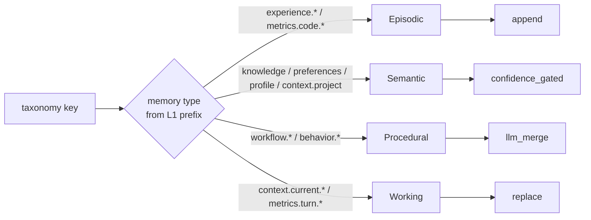
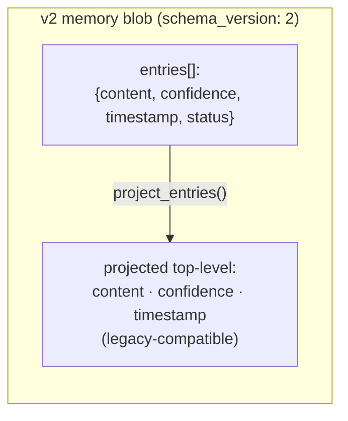
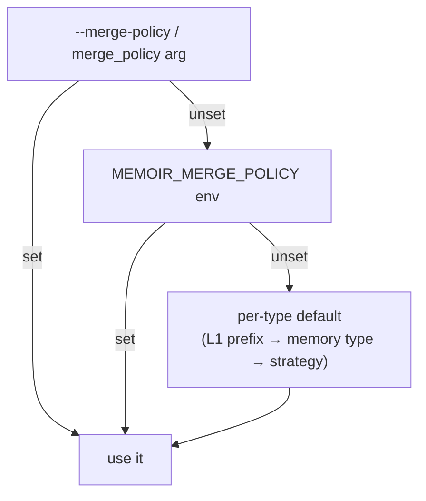
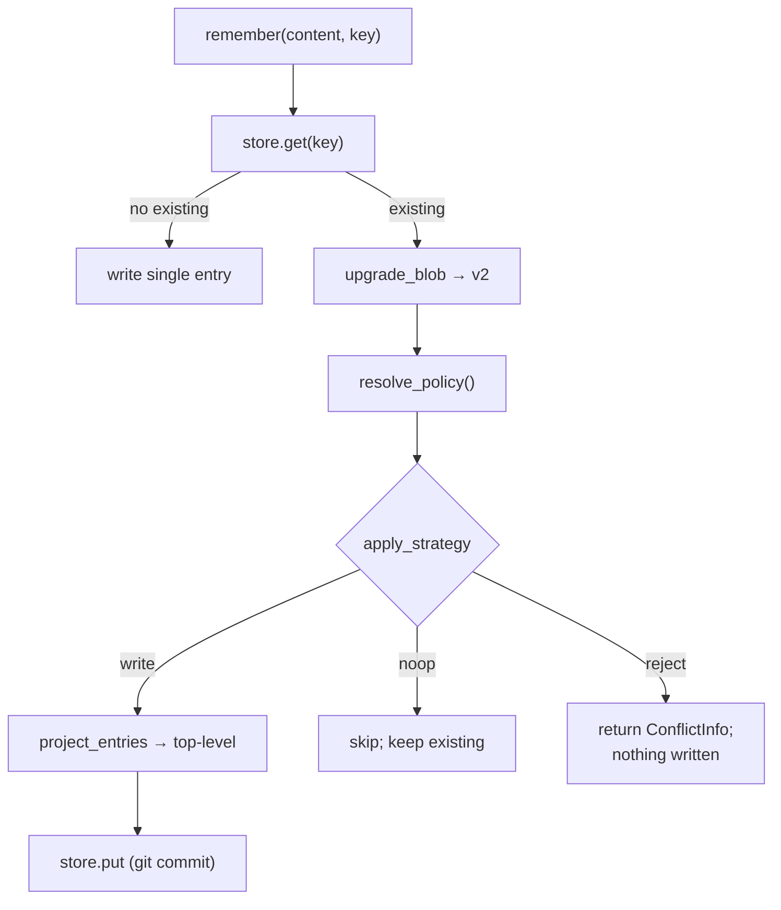

# Memoir Conflict & Merge Theory

## Summary

When a write lands on a taxonomy key that is **already occupied**, Memoir must decide
what happens to the prior value. Historically the answer was implicit and lossy: the
LLM classifier silently overwrote (last-write-wins), while caller-supplied `-p` paths
blindly appended an `[update]` paragraph that grew without bound. There was no merge,
no deduplication, and no notion that different *kinds* of memory want different
behaviour.

The conflict-and-merge subsystem replaces that with two cooperating ideas:

1. **A timestamped-facet storage model** (`schema_version: 2`) — a key holds a *list*
   of dated entries instead of one opaque string, with a projected top-level
   `content` so every existing reader keeps working.
2. **A pluggable set of conflict-resolution strategies**, selected by a precedence
   chain whose default is **derived from the memory type** of the key.

The result mirrors how human memory behaves: episodic logs accumulate, semantic facts
consolidate, procedures are refined, and working scratch is overwritten. The
implementation lives in `src/memoir/services/merge_policy.py` (pure, side-effect-free)
and is consumed by `MemoryService.remember()`, the CLI, the MCP server, and the UI.

## Core Philosophy

### Memory type decides the merge

A conflict is never resolved "in general" — it is resolved *for a kind of fact*. The
key insight is that a taxonomy path already encodes its memory type, so the **default**
strategy can be read straight off the key's L1 prefix. A write to `experience.*` is an
event (append); a write to `knowledge.*` is a fact (consolidate); a write to
`workflow.*` is a procedure (merge); a write to `context.current.*` is scratch
(replace).

### Detection is intentionally narrow

Memoir detects only **key collisions**: a write whose target path already holds a
non-empty value. A single `store.get` is the detector. It deliberately does *not*
attempt cross-key *semantic* collision detection (the same fact arriving under a
different path) — that would require a search/embedding pass on every write and was
left out of scope. The classifier remains write-blind for latency; resolution happens
at the storage boundary, not at classification time.

## The Facet Storage Model

A v2 blob keeps the legacy top-level fields **and** adds an `entries` list. The
top-level `content`/`confidence`/`timestamp` are a deterministic **projection** of the
active entries, so the 22+ existing readers and the entire web UI continue to read a
plain string unchanged. `entries` is purely additive.

* **`status`** is `active` (participates in the projection) or `superseded` (retained
  for audit, excluded from the projection).
* **Projection** joins active entries with the legacy `"\n\n[update] "` separator, so a
  two-entry append is *byte-identical* to the old behaviour — existing snapshots and
  the UI's change-detection are unaffected.
* **Lazy upgrade**: a legacy v1 blob (bare `content`) is lifted to a single-entry v2
  blob on its next write via `upgrade_blob()`. There is no bulk migration; read-only
  paths project on the fly.

!!! note "Why a projection?"
    Keeping a rolled-up `content` string at the top level is the single lever that lets
    a deep storage change ship without touching dozens of readers, the proof system, or
    the frontend. New code reads `entries`; old code reads `content`; both stay correct.

## The Strategy Menu

Six strategies, defined as `ConflictStrategy` in `merge_policy.py`:

| Strategy | On an occupied key | Loses data? | LLM? |
|---|---|---|---|
| `append` | adds a new active entry (subject to a cap) | no | no |
| `replace` | drops prior actives, keeps only the new entry | working-tree yes; git history no | no |
| `confidence_gated` | writes only if `new.confidence ≥ max(existing active)`, else no-op | no (keeps the more confident value) | no |
| `llm_merge` | consolidates prior + new into one entry, supersedes priors | no (consolidated) | yes (haiku) |
| `merge_on_read` | stored like `append`; consolidation deferred to read time | no | at read, opt-in |
| `reject` | does not write; returns a `ConflictInfo` | no (nothing changes) | no |

A few properties worth calling out:

* **`confidence_gated` only "bites" the LLM branch.** Caller-supplied `-p` writes hard-set
  confidence to `1.0`, so the gate always passes there (it behaves as replace). It only
  changes behaviour when incoming confidence is `< 1.0`, i.e. an LLM classification —
  exactly where a low-confidence auto-capture should not clobber a high-confidence fact.
* **`reject` is the machine-readable conflict signal.** It is what powers interactive
  resolution in the CLI and read-merge-write loops over MCP — the caller inspects the
  returned `conflicts` and re-issues the write with a chosen strategy.
* **`replace` collapses to a single entry by design**, which is what keeps "flat" keys
  (`metrics.turn.*`, scalar onboard pointers, `memoir watch` re-scans) bounded.

## Fit Into the Four Memory Types

The classical cognitive taxonomy maps cleanly onto Memoir constructs, and each type
has a natural default strategy. The facet `entries` list is the shared substrate;
the *strategy* and *projection* are what differ.

| Memory type | "What is it?" | Memoir paths / construct | Facet behaviour | Default strategy |
|---|---|---|---|---|
| **Working** | transient task scratch | `context.current.*`, `metrics.turn.*` | one active entry, aggressively replaced/capped | `replace` |
| **Episodic** | time-stamped events; "what happened, when" | `experience.*`, `TimelineMemento`, `metrics.code.*` | ordered log; all entries active, none superseded | `append` |
| **Semantic** | facts, preferences, decisions; "what is true" | `knowledge.*`, `preferences.*`, `profile.*`, `context.project.*`, `relationships.*`, `ProfileMemento` | one consolidated active entry; contradictions resolved | `confidence_gated` |
| **Procedural** | skills, how-to, workflows; "how to do X" | `workflow.*`, `behavior.*` | one current procedure, refined; old versions retained | `llm_merge` |

This is also *why* the unbounded-growth problem disappears: only **episodic** keys
default to `append` (a log is *supposed* to grow, and is still bounded by
`MEMOIR_FACET_MAX_ENTRIES`). Semantic and procedural keys consolidate; working keys
replace. The append-everywhere pathology is gone by construction.

!!! tip "Memoir generalizes the Memento pattern"
    `TimelineMemento` (episodic) and `ProfileMemento` (semantic) already encoded the
    episodic-vs-semantic split as *separate subsystems*. The facet model + per-type
    policy expresses the same distinction as **one substrate with different policies**,
    extending it to working and procedural memory.

## Resolution Precedence

The effective strategy for any write is resolved by `resolve_policy()` along a strict
precedence chain. An explicit choice always wins; the per-type default is the floor.

The global escape hatch `MEMOIR_MERGE_POLICY=replace` restores the old
append/overwrite-flavoured behaviour wholesale for any caller depending on the prior
semantics.

## The Write Path

End to end, a `remember()` write resolves like this:

Prior values are never truly lost: every `store.put` is a git commit, so even a
`replace` leaves the old value recoverable from history.

## Interfaces

The same strategy machinery is exposed at every layer:

* **CLI** — `memoir remember … --merge-policy <strategy>` overrides per call;
  `--interactive` (`-i`) probes with `reject`, renders existing-vs-incoming, and prompts
  `replace / append / merge / skip` per conflict. `--replace` remains as a back-compat
  alias for `--merge-policy replace`.
* **Environment** — `MEMOIR_MERGE_POLICY` (global default override),
  `MEMOIR_FACET_MAX_ENTRIES` (cap on append growth; `0`/`none` disables),
  `MEMOIR_RECALL_MERGE=llm` (enable merge-on-read consolidation).
* **MCP** — the `memoir_remember` tool accepts `merge_policy`; passing `reject` returns
  the existing value under `conflicts` without writing, so an agent can run its own
  read-merge-write loop.
* **UI** — the memory detail drawer shows a **facet history** of the timestamped entries
  that roll up into the displayed content, with `superseded` badges.

## Merge-on-Read

Because the top-level `content` is always a deterministic projection, *consolidated
reads are free* — every reader already sees a coherent string. `merge_on_read` adds an
**opt-in** LLM consolidation at retrieval time: when `MEMOIR_RECALL_MERGE=llm` (or
`get(consolidate=True)`), a multi-entry blob's returned content is replaced by an LLM
consolidation of its active entries. It is best-effort and falls back to the
deterministic projection inside an event loop or on any LLM error, so it can never
break a read.

## Theoretical Foundation

### Last-write-wins is a policy, not a law

A content-addressed, git-backed store gives Memoir a spectrum of conflict semantics
that a flat key-value store lacks. `replace` is plain last-write-wins; `append` is an
ever-growing log; `confidence_gated` is a priority-merge keyed on a metadata field;
`llm_merge` is a semantic three-way-style consolidation (without a base); `supersede`
(via `status`) is a tombstone that preserves history. The facet list is what makes all
of these expressible over the *same* stored value, rather than requiring different
storage shapes.

### Cognitive grounding

The four-type taxonomy (working / episodic / semantic / procedural) is the standard
decomposition of long-term and short-term memory in cognitive science and in agent
memory architectures (CoALA, MemGPT, Generative Agents — see
[Related Work](related-work.md)). Memoir's contribution is to make the *merge policy* a
function of the memory type, so retention behaviour is correct **by default** rather
than something every caller must configure. Episodic memory accumulates because
forgetting an event corrupts the record; semantic memory consolidates because a newer,
higher-confidence fact should supersede a stale one; procedural memory merges because a
refinement should fold into the procedure, not fork it.

### Bounded growth as an invariant

The pathology of the old append-everywhere default was unbounded blob growth. Three
mechanisms now bound it: (1) only episodic keys append by default; (2)
`MEMOIR_FACET_MAX_ENTRIES` prunes the oldest entries past a cap; (3) `replace` and
`llm_merge` collapse to a single entry. Growth is now a *deliberate* property of
episodic logs, not an accident of every write.

## Conclusion

Conflict and merge in Memoir is the point where "Git for AI memory" earns its name: a
write is not a blind overwrite but a typed merge against history. The timestamped-facet
model provides the substrate, the strategy enum provides the vocabulary, and the
per-type default table provides the judgement — so that working memory stays fresh,
episodic memory stays complete, semantic memory stays current, and procedural memory
stays coherent, all without the caller having to think about it.
