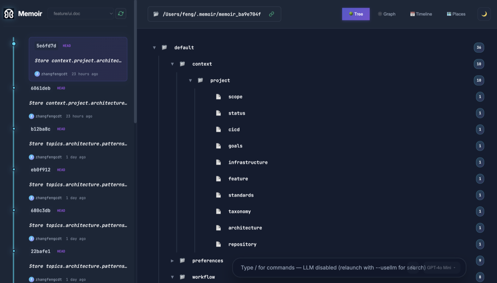
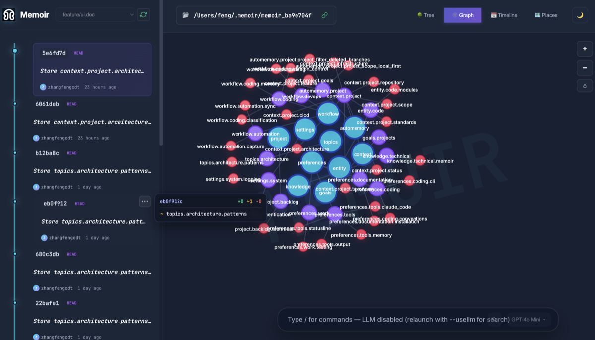
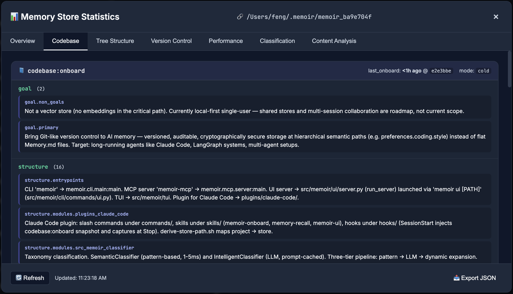

# UI

The memoir web UI is an interactive, D3.js-backed explorer for a memoir store. It exposes the same operations as the CLI — connect to a store, browse memories by semantic path, switch branches, walk commits, verify cryptographic proofs — but in a visual form that makes structural and temporal relationships easier to see.

## Launching

```bash
# Connect to an existing store
memoir ui /path/to/store

# Enable semantic search in the UI's command input
memoir ui /path/to/store --usellm

# Custom port (default: 8080)
memoir ui /path/to/store --port 8081
```

The server binds to `http://localhost:8080` and opens the UI in the browser. `Ctrl-C` in the launching shell stops it.

## Layout

The UI is one page with three fixed regions and a floating command input.

### Top bar

| Region | Purpose |
|---|---|
| **Branch selector** (top-left) | Switch the active memoir branch. Mirrors git branch semantics — each branch has its own commit history and HEAD. |
| **Store path** (top-center) | The memoir store currently connected. Click the 🔗 icon to copy the absolute path. |
| **View switcher** (top-right) | Toggle between **Tree**, **Graph**, **Timeline**, and **Places** without losing the current branch and store context. |
| **Theme toggle** (far right) | Switch between light and dark themes. |

### Commit rail (left sidebar)

Every commit on the current branch, newest first. Each row shows:

- The short commit hash (e.g. `5e6fd7d`) and a `HEAD` badge when applicable.
- The commit message — typically `Store <path>.<name>` for auto-classified memories.
- Author and relative age.
- A diff badge (`+N ~N -N`) revealed on hover, counting added / modified / removed paths.

Clicking a commit inspects its change set in the main canvas.

### Main canvas

Renders the currently-selected view. See [Views](#views) below.

### Command input (bottom)

Type `/` to open a slash-command menu, or type plain text for natural-language search. Semantic search activates when the server was launched with `--usellm` (otherwise the input falls back to keyword matching).

## Views

### Tree

Hierarchical, folder-style view of memory paths. Expand a node to reveal its children; click a leaf to see the memory value, classification metadata, and commit provenance.

{ width="720" }

Best for: drilling into a known category, confirming a semantic path exists.

### Graph

Force-directed node graph of the taxonomy. Edges connect parent paths to children.

{ width="720" }

Node coloring:

| Color | Meaning | Example |
|---|---|---|
| **Teal** | Root category | `workflow`, `settings`, `project`, `preferences`, `entity` |
| **Purple** | Sub-category | `workflow.coding`, `preferences.tools`, `context.project` |
| **Red** | Leaf (actual stored memory) | `workflow.coding.classification`, `preferences.tools.memory` |

Hover any node to highlight its neighborhood; hover a commit in the rail to see a diff overlay on the graph.

Best for: understanding how a store is organized at a glance, spotting over-broad or orphan categories.

### Timeline

Chronological feed of commits with per-commit file diffs. Each entry expands to show the memory values added, modified, or removed in that commit.

Best for: reviewing recent activity, auditing what changed between two points in time.

### Places

Groups memories by location metadata. Useful when memories carry `place` / `site` attributes — e.g. commits captured across different projects or repositories.

## Memory Store Statistics (`/stats`)

Typing `/stats` in the command input opens the **Memory Store Statistics** panel — a 7-tab modal over the connected store.

{ width="640" }

| Tab | What it shows |
|---|---|
| **Overview** | Top-line counts: total memories, commits, branches, namespaces. |
| **Codebase** | The `codebase:onboard` snapshot — goals, structure, modules — when the store was populated via `/memoir-onboard`. |
| **Tree Structure** | Depth, branching factor, and leaf counts at each level of the taxonomy tree. |
| **Version Control** | Commits per branch, merge history, HEADs, recent activity. |
| **Performance** | Classification and search latencies, cache hit rates. |
| **Classification** | Distribution of memories across the taxonomy — which paths are hot, which are sparse. |
| **Content Analysis** | Per-memory size, token counts, and content-type breakdowns. |

The footer offers **🔄 Refresh** to re-query the store and **📤 Export JSON** to download the raw statistics payload.

## Slash commands in the UI

The command input accepts the same mutation and inspection verbs as the CLI — `/connect`, `/new`, `/remember`, `/forget`, `/branch`, `/checkout`, `/merge`, `/commits`, `/blame`, `/proof`, `/verify`, `/stats`, `/help`, and more. Type `/help` to open the full command reference with examples.

Plain text (no leading `/`) is treated as a search query against the current store.

## Related

- [CLI Reference](cli.md) — the non-visual interface to the same store operations.
- [Architecture](architecture.md) — how the store, taxonomy, and classifier fit together behind the UI.
